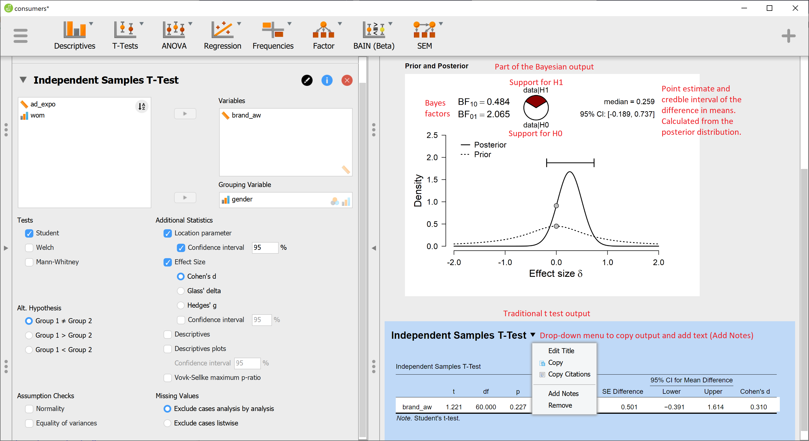
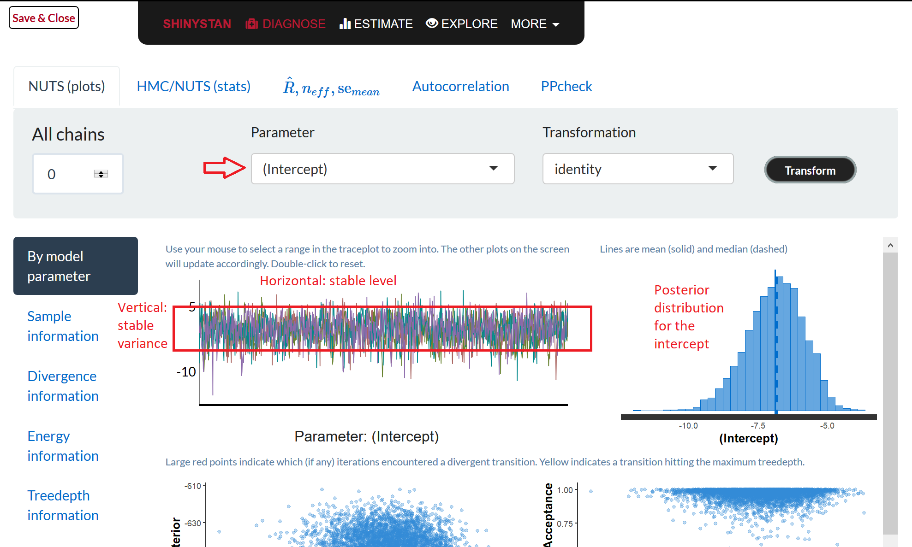
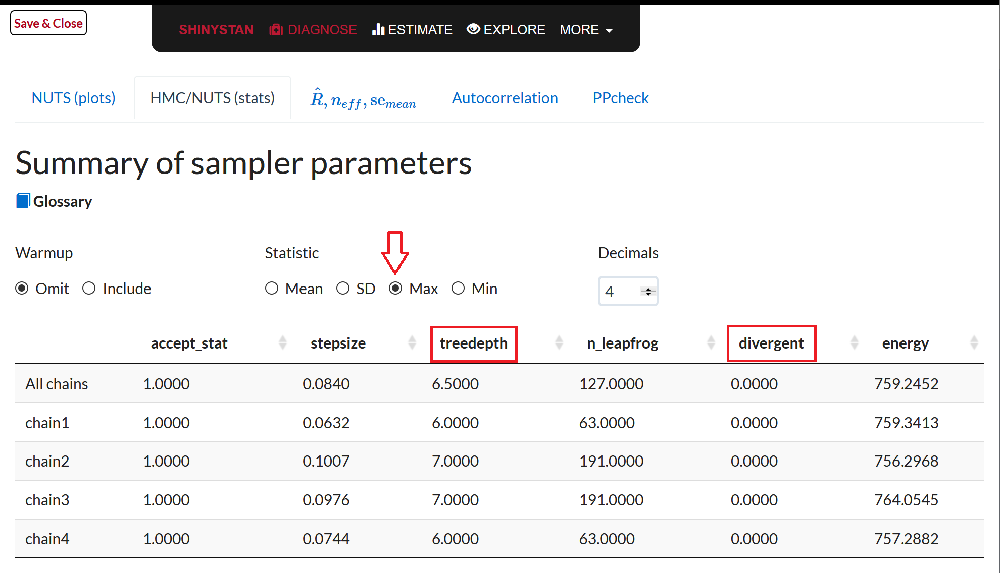
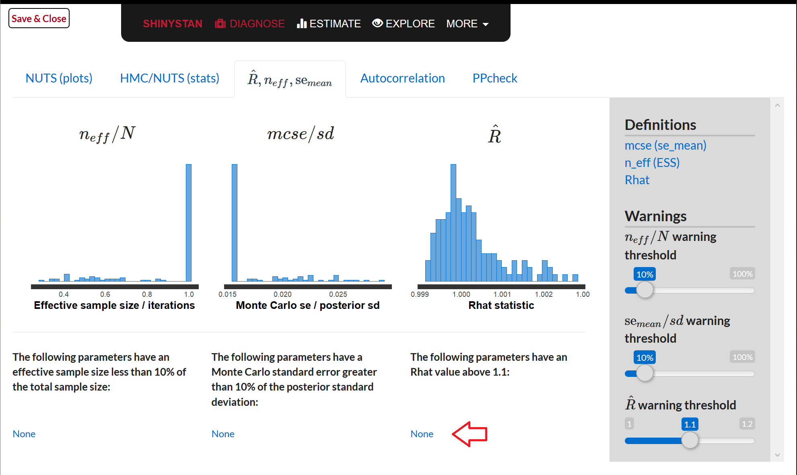
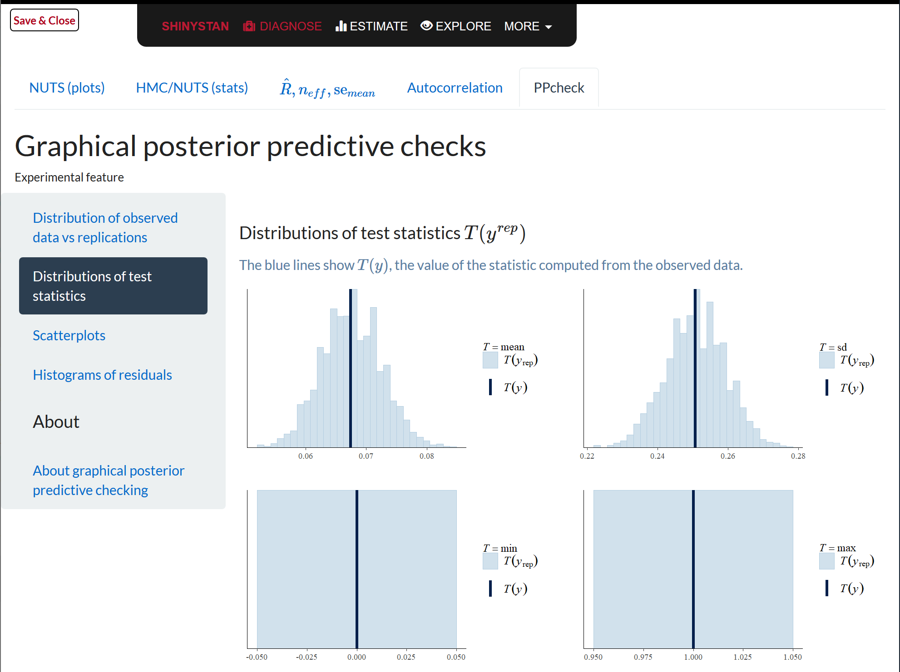
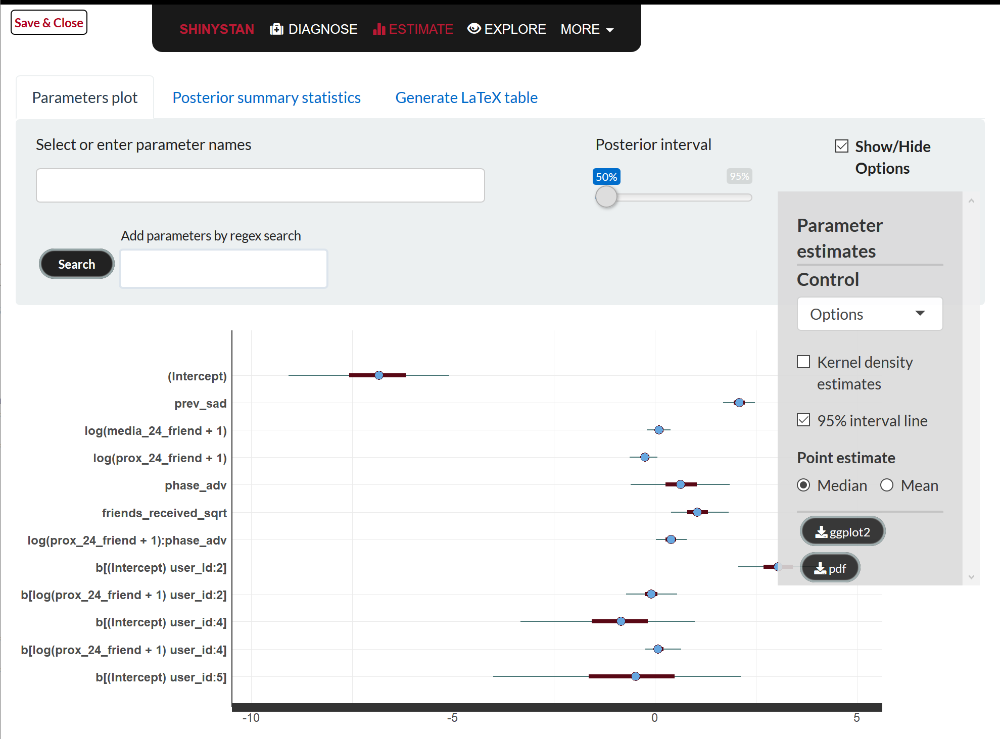
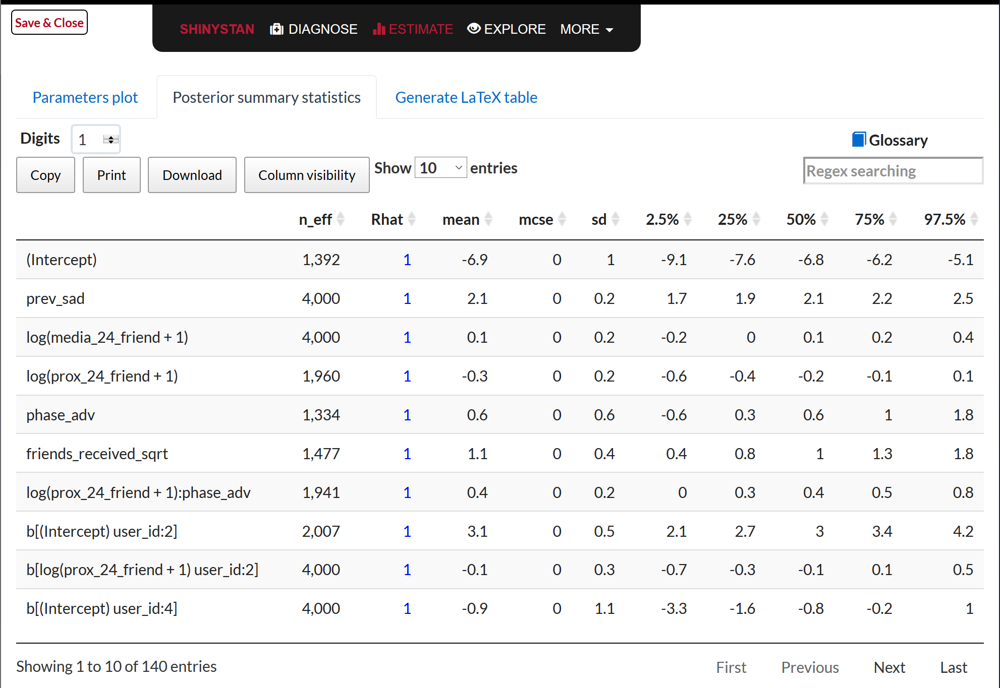

```{r setup, include = FALSE, echo=FALSE}
# Set overall options for knitting (rendering) the document.
set.seed(42) # Seed for random number generation
knitr::opts_chunk$set(
  cache.extra = knitr::rand_seed,
  eval = TRUE, #by deault, execute the code in code chunks
  echo = FALSE, #by default, do not show the contents of code chunks
  message = FALSE, #by default, do not show messages
  warning = FALSE #by default, do not show warnings
  )

#R libraries that are used in this paper.

# R library (package) for APA6-style tables, figures, and statistical results
# formatting.
library(papaja)

# R library for Bayesian analyses with an interface like functions in the lme4
# package.
library(rstanarm)

# Library to insert figures and create tables (among other things) in RMarkdown
# documents.
library(knitr)

# Set of R libraries for consistent and transparent data handling and graphing.
library(tidyverse)

#Create bib file with references to R packages.
knitr::write_bib(c("knitr", "tidyverse", "papaja", "rstanarm", "lme4", "shinystan", "loo", "shinystan"), file = "r-references.bib")
```

# What Is The Problem With Null Hypothesis Significance Testing?

Imagine that you have executed a regression analysis and one of the regression coefficients is not statistically significant, so you do _not_ reject the null hypothesis of no effect in the population. I am nearly sure that you commit a _Type II error_ here: rejecting a false null hypothesis. Why? Because the regression coefficient may be very close to zero in the population but it will hardly ever be exactly zero. So the null hypothesis of zero effect is nearly always false [@bakanTestSignificancePsychological1966: 425-6].

Why test a two-sided null hypothesis if we know that it is wrong? What information do we gain if we reject a null hypothesis that is nearly sure to be wrong? It is silly. From this perspective, it makes more sense to test _one-sided null hypotheses_. If we hypothesize that an effect can only be positive, for example, the null hypothesis of no effect or a negative effect can actually be true. In this case, we can fail to reject the null hypothesis without making a Type II error. Unfortunately, one-sided tests are unpopular in the field.

In a one-sided or two-sided test, can we conclude that the effect in the population is more different from zero, that is, stronger, for a rejected false null hypothesis than for a false null hypothesis that is not rejected? No, we can't for several reasons. Our sample can be more or less representative of the population: We may have drawn a sample with a large effect from a population with a very small effect or the other way around. In addition, a larger sample yields statistically significant results more easily than a smaller sample. Very small effects can be statistically significant in very large samples, whereas large effects can be statistically insignificant in a very small sample.

It is a common mistake to interpret statistical significance as an indication that an effect is substantial or substantively interesting. This mistake was noted early on [for example, by @tylerWhatStatisticalSignificance1931]. The book _Understanding the New Statistics_ [@CummingUnderstandingnewstatistics2012] offers a lucid discussion of this mistake. The binary decision associated with a null hypothesis significance test incorrectly suggests a qualitative difference between a statistically significant effect and an effect that is not statistically significant.

It is easy to misunderstand and misinterpret p values and confidence intervals because the probabilities involved are counterintuitive. We would like to receive probabilities for population values, such as the probability that the effect is positive in the population or the probability that the population effect is within a particular range. Instead, we get probabilities of sample outcomes. Instead of asking for the probability that it will rain tomorrow, this approach reasons: "If it rains tomorrow, what is the probability that we are having at least as many clouds as we have today?"

The frequentist approach to statistics, which underlies null hypothesis significance testing, assumes that there is one true population value. In this approach, a population characteristic (parameter) does _not_ have a probability. There is no probability distribution to a parameter. As a consequence, the following statements are not correct:

* A p value is the probability that the null hypothesis is true.
* A 95%-confidence interval contains the population values that have 95% probability of being true.

The practical value of this approach is quite limited. Imagine that you want to use your sample results for a practical decision such as fielding a new campaign. Based on your sample, you would like to calculate the probability that the effect of the campaign is above a particular threshold, for example, the minimum effect size that makes the investments in the campaign worthwhile. Your significance test only tells you whether you should reject the null hypothesis of no effect. Your confidence interval gives you plausible population values but not the probabilities of those values. It doesn't tell you the probability of a positive effect. Why? Because there is no probability distribution for a population characteristic in this approach.

Assuming (in the null hypothesis) a true population value, very efficient methods have been invented for generalizing results from samples to populations. In the pre-computer and early-computer era, this was the only option for statistical generalization. Thanks to our present-day computing power, however, we have alternatives, such as Bayesian statistics.

There are more problems with null hypothesis significance testing, some of which will be touched upon in later sections of this paper. Let us conclude this section with some references. You may want to know more about these problems or your reviewer may ask you why you do not test a null hypothesis. Consult or refer to publications like the _Understanding the New Statistics_ book referenced above, [@ziliakCultStatisticalSignificance2008] or [@morrisonSignificanceTestControversy1970] for an older survey of the discussion. Carver [-@carverCaseStatisticalSignificance1993] offers some suggestions on how to get articles published without significance tests. Levine et al. [-@LevineCriticalAssessmentNull2008; -@LevineQuantitativeCommunicationResearch2013] survey the problems of null hypothesis significance testing in published communication research.

# What Are The Benefits Of A Bayesian Approach?

This paper does not pretend to present an introduction to Bayesian statistics. It won't even present Bayes' theorem, which really is inadmissible in an introduction. There are several introductions to Bayesian statistics [@BerryStatisticsBayesianPerspective1996; @ClarkBayesianBasicsConceptual2014; @kurtBayesianStatisticsFun2019; @lambertStudentsGuideBayesian2018; @leeBayesianStatisticsIntroduction2012], among which I particularly recommend Erickson [-@EricksonBeginningBayes2017] as a first read. Here, I will just point out some benefits of a Bayesian approach in comparison to the standard frequentist approach.

## Intuitive results

In Bayesian statistics, population values have a probability distribution. In other words, Bayesian statistics allow us to speak of the probability that it will rain tomorrow given our knowledge of today's weather. It gives us probabilities like the ones that we use in ordinary life.

```{r posteriorexample, eval=TRUE, echo=FALSE, fig.asp=0.5, fig.pos='H', fig.cap="An example of a probability distribution for a parameter such as the regression coefficient in the population."}
# Illustrate the concept of a posterior distribution.
library(tidyverse)

# Generate a distribution for a regression coefficient.
set.seed(222)
regcoef <- data.frame(estimate = rlnorm(20000, 0.05, 0.2) - 0.7,
                      stringsAsFactors = FALSE) %>%
  mutate(type = ifelse(estimate > 0, "1", "0"))

# Plot the distribution.
ggplot(regcoef) +
  geom_histogram(aes(x = estimate, fill = type),
                 show.legend = FALSE,
                 bins = 60,
                 boundary = 0) +
  geom_vline(xintercept = median(regcoef$estimate)) +
  geom_text(aes(x = 0.5, y = 200, label = round(mean(regcoef$estimate > 0), 3) )) +
  scale_fill_manual(values = c("0" = "darkblue", "1" = "lightblue") ) +
  scale_x_continuous(name = "Regression coefficient in the population",
                     breaks = c(0, round(median(regcoef$estimate), 2), 0.5, 1.0, 1.5)) +
  scale_y_continuous(name = "Count or probability (density)",
                     breaks = NULL, minor_breaks = NULL) +
  theme_bw()
```

In the example of a regression coefficient estimating the effect of campaign exposure, a Bayesian analysis gives us a probability distribution of the effect in the population. Practically speaking, we obtain a long list of regression coefficient estimates. Usually, the median value (vertical line in Figure \@ref(fig:posteriorexample)) of this distribution is used as the point estimate.

The point estimate is a very poor summary of the distribution. The probabilities implied by the distribution are more interesting. The proportion of the estimates that are above zero, for example, can be interpreted as the probability that the effect is positive in the population. If you like, you can use this probability to test the one-sided hypothesis that the effect is positive. We can actually conclude that the probability of a positive effect in the population is `r 100 * round(mean(regcoef$estimate > 0), 2)` per cent in this example. In contrast, a significance test of the null hypothesis that the effect is not negative only allows us to conclude that our sample is very likely or very unlikely _if the null hypothesis is true_. We can or cannot reject the null hypothesis but we don't know the probability of a positive effect in the population.

A probability distribution of the regression coefficient in the population helps us to understand that it does not make sense to focus on one value as in a two-sided null hypothesis significance test. In theory, a regression coefficient, like most statistics, can have an infinite number of decimal places. The probability of one exact value such as 0.000000000000000000000(...and so on) must be close to zero. In other words, this one value is highly improbable. We know that beforehand, so we are wasting our time if we test against this one value.

Instead, we have to look at a range of values for the statistic [@kruschkeBayesianAssessmentNull2011: 302], the regression coefficient in the current example, if we want to use a probability in our conclusion. In line with the concept of confidence intervals, Bayesians use the _credible interval_ as the population values that are most likely to be true. The 95% credible interval, for example, contains the 95 per cent estimates in the center of the probability distribution. Here, we can say that the population value has 95 per cent probability (or chance) to be within this credible interval. This is how we would like to (and sometimes erroneously do) interpret the traditional 95 per cent confidence interval.

Let us return to the practical decision on launching a campaign based on a pretest in a sample. The Bayesian probability distribution of the regression coefficient for the effect of campaign exposure tells us the probability of a positive effect versus the probability of a negative effect in the population. If the campaign is intended to have a positive effect, we may advise to launch the campaign if the probability of a positive effect is much larger than the probability of a negative effect. What constitutes "much larger" is a substantive decision, not a statistical decision. If we can quantify the costs and benefits of the campaign, we can use the probability distribution to calculate the expected (averaged over the probability distribution) benefits and compare them to the costs.

## Other distributional assumptions {#assumptions}

The sampling distribution is central to null hypothesis significance testing and confidence intervals. We usually approximate the sampling distribution by a theoretical probability distribution, such as the normal, t, or F distribution. The approximation only works if the data meet requirements such as a normal distribution in the population, equal population variances, or minimum sample size. If your data does not meet the requirements, the results are not to be trusted.

The sampling distribution, however, does not play a role in a Bayesian approach. In the latter approach, we are estimating probabilities of population values, not probabilities of samples. As a consequence, we do not care about requirements for approximating the sampling distribution with a theoretical probability distribution. The probability distribution resulting from a Bayesian analysis can have any shape.

This freedom comes at a cost. In Bayesian analysis, the researcher has to specify a probability distribution for each population value that is to be estimated. This probability distribution is called the _prior distribution_. The sample data update the prior distribution into the _posterior distribution_, which is the probability distribution that the researcher interprets and reports. Thus, Bayesian estimation learns from the data whereas a frequentist approach does not. But we have to provide prior distributions as a starting point for the learning process. A Bayesian approach then, comes with a different type of distributional assumptions, namely the choice of prior distributions.

How do we chose prior distributions? In the ideal case, the posterior distributions of previous research can be used as prior distributions in the analysis of new data. This is called an _informative prior distribution_. It represents more or less established knowledge about the statistic that we estimate, which should not change much if it is updated by the data in our new sample. This is a wonderful way of using existing information and accumulating knowledge.

If we do not have this type of information, we may resort to _weakly informative prior distributions_. These are theoretical probability distributions like the normal or t distribution centered at a possible and not too unlikely value. As prior distributions, they express our belief that the population value of the statistic is most likely to be found in a relatively restricted range. But we do not rule out that the true values are much higher or much lower than expected.

These prior distributions are called weakly informative because they are easily overridden by the sample data if the sample is not very small. As a consequence, the posterior distribution is usually hardly influenced by the choice of a prior distribution. A plot of a weakly informative prior distribution and the posterior distribution should show that the two are quite different. 

It is relatively safe to chose a weakly informative prior distribution. Still, it is wise to check that the results do not change substantially if you change the prior settings (robustness check). For guidelines, see @depaoliImprovingTransparencyReplication2017], who recommend to compare with a model estimated from _uninformative prior distributions_, which gives equal prior probabilities to all possible values of the statistic in the population (Figure \@ref(fig:uninformativeprior)).

```{r uninformativeprior, eval=TRUE, echo=FALSE, fig.asp=0.5, fig.pos='H', fig.cap="An uninformative prior (horizontal line), a weakly informative prior (t distribution with heavy tails), and the posterior distribution (histogram)."}
# Illustrate the concept of a prior distributions.
library(tidyverse)

# Generate a distribution for a regression coefficient.
set.seed(222)
regcoef <- data.frame(estimate = rlnorm(20000, 0.05, 0.2) - 0.7,
                      stringsAsFactors = FALSE)

# Plot the distribution.
ggplot(regcoef) +
  #posterior (at the back)
  geom_histogram(aes(x = estimate), fill = "lightblue",
                 binwidth = 0.03,
                 boundary = 0) +
  #uninformative (uniform) prior
  geom_segment(x = min(regcoef$estimate), xend = max(regcoef$estimate), y = 30, yend = 30) +
  #weakly informative (t) distribution
  stat_function(
    #function for scaling distribution to be visible in plot
    fun = function(x, df) {
          dt(x = x, df = 15) * 20000 * 0.03
        }
     ) +
   geom_text(aes(x = 0.35, y = 800, label = "posterior" )) +
   geom_text(aes(x = 1.1, y = 200, label = "weakly informative prior" )) +
   geom_text(aes(x = 0, y = 80, label = "uninformative prior" )) +
   scale_x_continuous(name = "Regression coefficient in the population",
                     breaks = c(0, round(median(regcoef$estimate), 2), 0.5, 1.0, 1.5)) +
   scale_y_continuous(name = "",
                     breaks = NULL, minor_breaks = NULL) +
   theme_bw()
```

In addition, a Bayesian approach requires another type of check. The posterior distribution is usually estimated with an iterative (MCMC) algorithm. This algorithm requires many steps (iterations) to arrive at a stable level of the parameter estimate. This phase is called the burn-in or warm-up phase. The algorithm is said to have converged when the estimates stabilize within a fixed range. When convergence has been achieved, an additional set of steps is required to find and count the values that the parameter estimate can take. 

The estimates from the steps in this second phase constitute the posterior distribution of the parameter, which is the analysis result. Posterior distributions can only be trusted if the algorithm has converged. Convergence can be checked visually or numerically; examples are provided in Section \@ref(usebayesian). If these checks give rise to doubts about convergence, the posterior distributions should not be interpreted. The model may have problems, for example, it can be too complicated to be estimated from the available data, or we simply need more step (iterations) to achieve convergence.

Both phases usually require thousands of steps, so estimation may take quite some computer time for complicated latent variable or multilevel models. For complicated models, a computer with ample memory and a fast processor comes in handy. Cloud computing is another option. For common statistical models such as analysis of variance or linear regression, however, ordinary computers produce results quickly.

Much work has be done and is still being done to develop safe weakly informative priors for different types of models. But Bayesian estimation is more complicated than approximating a sampling distribution with a theoretical probability distribution. Especially for complicated models, things may go wrong. For an extensive checklist, see _Improving transparency and replication in Bayesian statistics: The WAMBS-Checklist_ [@depaoliImprovingTransparencyReplication2017]. The upside: Complicated models can be estimated.

## Estimation of complicated models

As stated in the preceding section, the prior distribution brings our prior knowledge to bear in the estimation process. This knowledge can be quite superficial, for example, we just know that very large effects are impossible or highly unlikely, so we specify a weakly informative prior distribution. Why would we want to take quite superficial prior knowledge as our starting point?

A very practical reason for including even superficial prior knowledge is that it helps the estimation algorithm. The prior information nudges the estimation algorithm in a plausible direction---even if it is not necessarily the right direction---so estimation will converge more easily and more quickly. For relatively simple models, this nudge hardly makes a difference, but complicated models, such as multilevel models with random intercepts and random slopes, can sometimes only be estimated with this kind of help.

## Precautions against overfitting the sample data

A focus on statistical significance is at the expense of attention to model fit: How well does the model fit the current data? More importantly, how well would the model fit new data? Would the results replicate?

Traditional frequentist statistics gives us the point estimate that fits the current sample best. For example, we get the value of the regression coefficient that best predicts the dependent variable scores from the independent variable cores in our sample. Another sample will most probably be different, so our current regression coefficient estimate will not be the best fitting estimate for the new sample. It is overfitted to our current sample.

The problem of overfitting a model to the data increases if the model becomes more complex. Every additional predictor adds to overfitting the model to the sample. The more complicated the model, the higher the risk of overfitting the model to the sample at hand. More complicated models, however, are more realistic because empirical reality tends to be complex. We end up with a conundrum, which is known as the bias-variance trade-off [@JamesIntroductionStatisticalLearning2017: 34-5]. We value realistic, hence complex models (little bias) but we also value replication, which is compromised by overfitting the model to the current sample (variance).

How can we identify and correct for overfitting? It is important to realize that p values are not related to the probability that results will replicate [e.g., see @carverCaseStatisticalSignificance1978: 385-6]. Adjusted _R_^2^ for a regression model downsizes the proportion of variance predicted ("explained") by the model in proportion to the number of predictors used, but the estimated regression coefficients are still overfitted to the sample data.

We need another way to tell us the probability that our results will replicate. The best option is to actually replicate our study. If sufficient data are at hand, a split-half approach can be used, which fits a model to the first half of the data (training set) and then tests it against the second half of the data by calculating how well the fitted model predicts the dependent variable in the test set (validation set). With insufficient data for a split-half approach or if we do not want to ignore half of the information when fitting and validating the model, resampling techniques can be used. These techniques repeatedly sample from the original sample and fit the model to each new sample (cross-validation), for instance, leave one randomly chosen observation out (leave-one-out cross-validation) or leave out a randomly selected subset of observations (k-fold cross-validation) [@efronComputerAgeStatistical2016: 213ff].

A Bayesian approach estimates a probability distribution (posterior) for a population value, not the single value produced in a frequentist approach. If we use the posterior distribution to predict outcomes in a new or re-sampled data set, the predictions will generally be better than using the point estimate obtained in a frequentist approach. There are additional techniques for reducing overfitting in a Bayesian approach, some of which are briefly discussed in the next section.

# How Can I Use A Bayesian Approach? {#usebayesian}

Statistical software for Bayesian analysis is increasingly available. Recent versions of SPSS offer Bayesian analyses (*Bayesian Statistics* in the *Analyze* menu). Bayesian alternatives to many types of statistical models are available as R packages; consult the task view [Bayesian](https://cran.r-project.org/web/views/Bayesian.html) or search for "Bayes" in other [task views](https://cran.r-project.org/web/views/). 

Here, I focus on two software packages for Bayesian analysis: a menu-driven software package (_JASP_) with a work-flow like SPSS for the most common statistical models and a command-driven R package (`rstanarm`), which is very good at estimating complicated models, such as non-linear multilevel models. The two software packages represent two different Bayesian approaches: a focus on null hypothesis testing versus a focus on parameter estimation [@kruschkeBayesianAssessmentNull2011].

## JASP

[JASP](https://jasp-stats.org/) is free statistical software developed and maintained at the University of Amsterdam by Eric-Jan Wagenmakers. It offers an SPSS-like interface featuring both traditional frequentist analyses and Bayesian analyses. In contrast to SPSS, the output is very much like a real document, which can be edited, so the user can add comments, interpretations, and conclusions. If you open a data set, the last saved output document is also opened. Results tables are formatted in APA style and they can be copied and pasted into Word or LaTeX documents. Figures can be copied and exported and, finally, there are provisions for interacting with the Open Science Framework. It takes very little time to learn using this interface if you are used to SPSS.

```{r JASPscreenshot, out.width='100%', fig.pos='H', fig.cap="Annotated (red) screen shot of the JASP interface after executing a Bayesian and a traditional independent-samples t test."}

```

Traditional (frequentist) estimation is available for all standard tests (t tests, ANOVA, regression, chi-squared tests) as well as more advanced tests, namely, MANOVA, repeated measurements ANOVA, exploratory factor analysis, confirmatory factor analysis for one factor, SEM (provided that you can specify the model in [lavaan](http://lavaan.ugent.be/) syntax), meta analysis, and basic network analysis. Note that the SEM menu has a separate entry for parallel mediation models, which does not require writing syntax. It has an option to draw the mediation model, although this figure does not include the estimate of the indirect effect. 

At the time of writing this text (November 2019), a Bayesian approach is mainly available for comparing group averages, for example, using data from experiments. JASP offers Bayesian analysis for t tests on one or two means, ANOVA, Repeated measures ANOVA, and ANCOVA. In addition, Bayesian estimation is available for correlations and for linear regression but not for regression models with dichotomous or categorical predictors (although the beta-version _BAIN_ module can compare models with categorical predictors). Finally, binomial and multinomial tests, contingency tables, and log-linear models can be executed in a Bayesian way. This is basically the range of models for which SPSS also offers Bayesian analyses.

JASP's Bayesian approach focuses on _Bayes factors_. A Bayes factor quantifies the support in the sample for one model in comparison to another model. The more a model is supported rather than the other model, the more evidence we have for the former model. Model comparison with Bayes factors takes into account the model complexity as a guard against overfitting the model to the sample data [@kassBayesFactors1995]. Rules of thumb have been developed for interpreting Bayes factor values as strength of the evidence in favor of a model. Check out the [Wikipedia page on the Bayes factor](https://en.wikipedia.org/wiki/Bayes_factor#Interpretation) for rules of thumb.

One of the two models that are compared is usually the model of no effect representing the null hypothesis. Thus, Bayes factors offer an alternative to traditional null hypothesis significance tests. A Bayes factor gives us a value expressing how much better the model allowing for an effect (H~1~) is supported than the model of the null hypothesis (indicated by _BF~10~_ in JASP output). At the same time, however, we can see how much better the null hypothesis is supported by the data (_BF~01~_ in JASP output). In Figure \@ref(fig:JASPscreenshot), the null hypothesis of equal population averages is more strongly supported by the data than the alternative hypothesis. In contrast, a null hypothesis significance test only tells us whether or not we should reject the null hypothesis. It doesn't provide us with evidence to accept it.

Bayes factors for a comparison between models representing a null and alternative hypothesis depend on the prior distribution that is used [@kruschkeBayesianAssessmentNull2011]. The choice of prior can make a world of difference here. Therefore, it is strongly recommended to execute a sensitivity test: How does the choice of prior distribution affect the Bayes factor? This type of test is available in JASP as the _Bayes factor robustness test_ option.

## R `rstanarm` package

The other Bayesian approach focuses on parameter estimation, modelling, and prediction. Here, we are usually dealing with more complicated regression models: non-linear and multilevel models. Estimation of these models is not trivial, requiring attention and effort. Estimation results and problems help us to reflect on the nature of the phenomena that we are trying to model. Null hypothesis testing plays, if any, a minor role in this approach. The book _Statistical Rethinking_ [@McElreathStatisticalRethinkingBayesian2015] offers an accessible introduction to this Bayesian approach and _Bayesian Data Analysis_ [@GelmanBayesianDataAnalysis2013] a more technical introduction.

The focus here is on the  R [`rstanarm` package](http://mc-stan.org/rstanarm/index.html) for Bayesian applied regression modelling [@R-rstanarm] and some auxiliary packages. This package was developed by Andrew Gelman's team at Columbia University. It combines the power of the stan modelling language with the ease of applying regression models offered by R packages such as `lme4` [@R-lme4]. In other words, you can run a Bayesian regression model with syntax that is not more complicated than running the same regression model in a frequentist approach. But yes, you have to work with R.

Let us illustrate how to apply Bayesian regression models using `rstanarm`. Consult Muth et al. [-@TQMP14-2-99] for a more detailed step-by-step tutorial. Our example data concern students in a US dormitory [@MadanSocialsensingepidemiological2010], who submitted daily health reports including their sadness status (sad versus not sad, variable `sad.depressed`) during a few months. The data set can be downloaded [here](https://wdenooy.github.io/Switch2Bayesian/sadness.csv). We will try to predict their sadness status from the (logarithm of the) number of contacts with sad friends within the dormitory using spatial contacts (variable `prox_24_friend`) and mediated contacts (variable `media_24_friend`) in the 24 hours preceding health report submission. We control for the student's sadness status on the previous day (variable `prev_sad`). Does sadness spread via contacts and communication?

### Estimation

Because of the dichotomous nature of the dependent variable, we use logistic regression. We have multiple health reports per student, so we use a multilevel model with health reports nested within students. As a first step, we estimate a variance components model, that is, a model with random (varying) intercepts but without random (varying) slopes and student-level predictors (code not reproduced here). A random (varying) intercept captures a student's propensity for sadness. Some students are just more often sad than other students.

Next, we estimate a model with varying slopes of spatial contact (code not reproduced here). This model allows spatial contact to have different effects on the odds of being sad for different students. Finally, we add two student-level predictors, namely popularity as the (square root of) the number of friendship nominations received within the dorm (variable `friends_received_sqrt`) and the student's study phase (variable `phase_adv`, 1 : advanced study phase, 0: early study phase). The latter student-level variable is used to predict variation in the effect (slopes) of spatial contact with sad friends. The R code for this model is depicted below.

```{r loadresults}
# Instead of estimating the three models anew, previously stored fitted models
# are loaded.
load("reports_fit1.stanreg") #random intercepts
load("reports_fit2.stanreg") #random intercepts and random slopes
load("reports_fit3.stanreg") #random intercepts and slopes, and level-2 predictors
```

```{r estimation, echo=TRUE, eval=FALSE}
# R code for estimating a multilevel logistisc regression model with random
# intercepts and random slopes with student characteristic 'adv_phase'
# predicting slope variation.

# Load the rstanarm and rstan packages and set stan options.
library(rstanarm)
library(rstan)
#Set options for multicore CPU with excess RAM.
rstan_options(auto_write = TRUE)
options(mc.cores = parallel::detectCores())

# Load the data (first download it to your R working directory).
reports <- read.csv("sadness.csv")

# Estimate the model.
reports_fit3 <- stan_glmer(formula = sad.depressed ~  #outcome
  prev_sad + log(media_24_friend+1) + log(prox_24_friend+1) + #level-1 predictors
  phase_adv + friends_received_sqrt + #level-2 predictors (for intercept)
  phase_adv * log(prox_24_friend+1) + #level-2 predictor for slope
  (1 + log(prox_24_friend+1) | user_id), #intercept varying across students
  data = reports, #data frame stored in sadness.csv
  family = binomial(link = "logit"), #logistic link
  # prior_intercept = normal(0,10,autoscale=TRUE), #intercept prior
  # prior = normal(0, c(2.5, 2.5, 2.5),autoscale=TRUE), #regression coefficients
  # prior_covariance = decov(regularization = 1, concentration = 1, shape = 1,
  # scale = 1), #covariance prior
  # iter = 2000, #default number of iterations (including warmup iterations)
  # warmup = floor(iter/2), #default number of warmup runs: half of all iterations
  # adapt_delta = 0.95, #default target average acceptance probability
  # max_treedepth = 10, #max steps within an iteration
  seed = 9122) #randomiser seed for reproducibility
```

The `stan_glmer()` function in the `rstanarm` package mimics the `glmer()` function in the `lme4` package, which estimates **g**eneral **l**inear **m**odels with a multilevel structure (**m**ixed **e**ffects). The regression model is specified as a formula with the dependent variable to the left and the predictors to the right of the tilde. Random (varying) intercepts and varying slopes are specified between parentheses using the symbol `|`, which separates the varying parameters (`1` represents the intercept) from the level at which they are allowed to vary (`user_id` is the student ID number). The blog [Using R and lme/lmer to fit different two- and three-level longitudinal models](https://rpsychologist.com/r-guide-longitudinal-lme-lmer) [@magnussonUsingLmeLmer2015] [@magnussonUsingLmeLmer2015] shows how to specify more complicated multilevel models.

The `family =` argument is followed by arguments that are specific to Bayesian inference. They are commented out to indicate that they represent the default values at the time of writing this paper. The default values for the prior are good starting values, but you would have to change them if you want to compare the results to a model with another prior (robustness check). Note that the default values may change in new releases of the `rstanarm` package due to new insights. For research to be reproducible, it is recommended to specify the priors. You can get the default prior distributions if you apply the `prior_summary()` function to the fitted model.

The `iter =` argument is the most important argument for us. It specifies the number of samples (iterations) that are used to estimate the posterior distributions. On a computer with a multiple core processor and with the option `options(mc.cores = parallel::detectCores())` set, this number of samples will be drawn by each available core. With a processor containing four cores, four times 2,000 samples will be drawn by default. Half of these are used for burning in (option `warmup =`), that is, for converging to a stable range for the parameter estimates. These samples are not used for the posterior distribution. The second half of the samples are used to estimate the parameters (the posterior distributions). If the estimation process does not converge, the main solution is to increase the number of iterations.

### Convergence checks {#checks}

As argued in Section \@ref(assumptions), it is of paramount importance that convergence has been achieved before we interpret and use the posterior distributions. The R package `shinystan` [@R-shinystan] offers an interactive user interface for checking the estimation process and inspecting the results.

```{r shinystan, echo=TRUE, eval=FALSE}
# Package for interactive inspection of stan estimation process and results.
library(shinystan) 

# Display convergence checks for the third fitted (rstanarm) model.
# May take some time!
launch_shinystan(reports_fit3)
```

```{r shinystanshot1, out.width='100%', fig.pos='H', fig.cap="Trace plot and posterior distribution for each parameter. Annotations are in red."}
# Show first shinystan screen shot.

```

Shinystan opens a window in your web browser with four pages: Diagnose, Estimate, Explore, and More. The Diagnose tab contains convergence checks and other checks on the estimation process. Figure \@ref(fig:shinystanshot1) shows the first tab on the Diagnose page, displaying the estimation process for the intercept of the regression model.

The top-left graph is the *trace plot*, showing the intercept estimates (vertical axis) for all subsequent samples (iterations, horizontal axis) for all cores (chains, represented by line color). These are the estimates for the second half of the iterations, so after warm-up/burn-in has completed. The estimation process must have converged in the first half, so the average estimated value for the intercept should not change (increase or decrease) during the second half of the estimation process. This seems to be the case here. In addition, the variation in estimates (vertical differences) should have stabilized. Again, this seems to be the case here.

The top-right figure shows the posterior distribution of the intercept. This is actually the analysis result, which is summarized on the Estimate page. It is shown here because it should display a rather regular, smooth shape. If we have too few iterations, this histogram will look jagged.

These are just checks on the intercept. The drop-down list under *Parameter* allows us to check the other parameters. It is good practice to check all parameters. A deviant pattern may indicate that a parameter could not be estimated in a satisfactory way. Perhaps we just have insufficient data to estimate a particular parameter or this parameter is superfluous. In the present example, the variance of the random slopes of spatial contact (parameter `Sigma[user_id:log(prox_24_friend + 1),log(prox_24_friend + 1)`) seems to be hard to estimate (if you run the code, you can check this).

```{r shinystanshot2, out.width='100%', fig.pos='H', fig.cap="Summary diagnostics for the sampler. Annotations are in red."}
# Show second shinystan screen shot.

```

Figure \@ref(fig:shinystanshot2) shows the *HMC/NUTS (stats)* tab on the Diagnose page. It summarizes some characteristics of the sampler (**N**o **U**-**T**urn **S**ampler) used. I recommend to select the *Max* option and pay attention to the *treedepth* and *divergent* columns. Tree depth represents the number of steps within an iteration (sample). Maximum tree depth is 10 by default. If this maximum appears in this summary of sampler parameters, it is wise to re-estimate the model with a higher value for the `max_treedepth =` argument.

The *divergent* column should only contain zeros. Divergence during the estimation process is a serious problem (see [Brief Guide to Stan’s Warnings](https://mc-stan.org/misc/warnings.html#divergent-transitions-after-warmup)). Sometimes this problem can be solved by setting the argument `adapt_delta =` closer to 1.00. This will increase estimation time.

```{r shinystanshot3, out.width='100%', fig.pos='H', fig.cap="Success of the sampler for parameters in terms of the standard error of the mean of the posterior draws, the effective number of samples, and potential scale reduction. Annotations are in red."}
# Show third shinystan screen shot.

```

It can be more or less difficult for the sampler to find valid new values for a parameter. It can be difficult if iterations are highly correlated. If the sampler has substantial problems in this department, relatively few values are found that can be regarded as truly different samples. As a consequence, the number of effective samples ($n_{eff}$) is low, which increases the standard error of the mean of the estimates ($mcse$). In this situation, the posterior distribution is based on relatively little information. More iterations are needed to create a reliable posterior distribution. 

In addition, the Rhat ($\hat{R}$) statistic indicates if estimation had converged. If convergence has been achieved, the value of this statistic is near 1.0. A value close to 1.0 does not prove that convergence has been achieved, but a value that is not close to 1.0 indicates convergence problems. In the latter case, we had better re-estimate the model with a larger number of iterations or with a larger share of the iterations as warm-up phase.

Parameters for which estimation is problematic according to the rules of thumb (which can be adjusted in the right-hand panel) are listed below the graphs. In Figure \@ref(fig:shinystanshot3), it only says "none" below the graphs, so there are no parameters with estimation problems according to these three checks.

```{r shinystanshot4, out.width='100%', fig.pos='H', fig.cap="Posterior predictive checks."}
# Show fourth shinystan screen shot.

```

If the estimation process is successful, the estimated model should predict the observed outcome scores well. We can use the (joint) posterior distributions of the model parameters to predict outcome scores. The PPcheck tab of the Diagnose page applies this principle many times and calculates the mean and standard deviation of the outcome scores. The results are represented by the light-blue histograms in Figure \@ref(fig:shinystanshot4). In the present example, mean outcome is the proportion or probability of reporting sadness. The dark vertical line represents the proportion of sad reports in the sample. This value should be somewhere near the center of the predicted values (the histogram). This is the case here.

In addition to the mean, the standard deviation, minimum and maximum value of the outcome variable are predicted and compared to the values in the sample. In a logistic regression model, these values are not very interesting. The standard deviation of a dichotomous variable (like sad versus non-sad) is a function of the mean. The minimum and maximum values can only be zero or one (if the outcome variable is coded this way). For other types of regression models, however, these statistics can be of interest.

```{r shinystanshot5, out.width='100%', fig.pos='H', fig.cap="Visual summary of the results."}
# Show fifth shinystan screen shot.

```

The Estimate tab presents the estimation results both as a graph and a table. The plot in Figure \@ref(fig:shinystanshot5) summarizes the posterior distributions of parameters. By default, the median of the posterior distribution is used as the point estimate (blue dot) and both the 50 and 95 per cent credible intervals are shown as a fat and thin line segment. These settings can be adjusted with *Posterior interval* and *Show/Hide Options*. The latter dialog also allows color adjustment and exporting the graph as a `ggplot2` plot, which can be included and further modified in R, or as a PDF picture.

The plot shows the first (twelve) model parameters but you can select the parameters to be displayed. This does not work well in all browsers. Also note that the web page may become unresponsive if you select many parameters.

```{r shinystanshot6, out.width='100%', fig.pos='H', fig.cap="Tabular summary of the results."}
# Show sixth shinystan screen shot.

```

The table of parameter estimates (Fig. \@ref(fig:shinystanshot6)) can be browsed and adapted more easily than the graphical representation. Select the number of digits, columns, and rows (entries) to be shown. Note that at most 100 rows can be shown. The table as shown can be copied, printed, or downloaded as CSV or PDF. A separate tab on the Estimate page offers the option to construct a LaTeX results table, which can be copied and pasted into a (La)TeX word processor.

### Using the results

The main result of this type of Bayesian analysis consists of a (long) list of estimated regression equations. Each iteration (sample) during the estimation phase yields an estimate for each parameter in the model. Table \@ref(tab:jointposterior) shows a small part of this list.

```{r jointposterior, eval=TRUE, echo=TRUE}
# Display part of the joint posterior distribution.

# Requires the rstanarm, knitr and kableExtra libraries.
library(rstanarm)
library(knitr)
library(kableExtra)

# Extract the parameter estimates from a fitted rstanarm model.
posterior_model3 <- data.frame(reports_fit3, check.names = FALSE)

# Show the first 5 estimates for the (seven) fixed effects.
kable(posterior_model3[1:5, 1:7], digits = 2, booktabs = TRUE,
      caption = "The estimated fixed effects for the first five entries 
      in the joint posterior distribution of the model with random slopes 
      for spatial proximity and study phase as slope predictor.") %>%
  kable_styling(bootstrap_options = c("basic", "condensed"), 
                full_width = T, font_size = 12, 
                latex_options = c("scale_down"))
```

```{r eval=TRUE, echo=FALSE}
# Inline r code cannot handle `` around variable names, so add some renamed variables.
posterior_model3 <- posterior_model3 %>%
  mutate(
    media_24_friend = `log(media_24_friend + 1)`,
    prox_24_friend = `log(prox_24_friend + 1)`,
    prox_24_friend_phase_adv = `log(prox_24_friend + 1):phase_adv`
  )
```

The posterior distribution of a parameter is just the column of this parameter in the list described above. The results presented by `shinystan` (Section \@ref(checks)) calculate the median (or mean) as point estimate and the 2.5 and 97.5 percentiles as limits of the credible interval. It is easy to test any hypothesis with the posterior distribution: Just calculate the probability that a regression coefficient is larger than a particular value or within a particulare range. The probability that the effect of mediated exposure to sad friends is larger than zero, for example, is calculated thus:

```{r eval=FALSE, echo=TRUE}
mean(posterior_model3$`log(media_24_friend + 1)` > 0)
```

The list is a joint posterior distribution, meaning that you can also extract probabilities for combinations of parameters. For example, the probability that the effect of mediated exposure is larger (more positive or less negative) than the effect of exposure through spatial proximity is calculated as:

```{r eval=FALSE, echo=TRUE}
mean(posterior_model3$`log(media_24_friend + 1)` > 
       posterior_model3$`log(prox_24_friend + 1)`)
```

The result is `r round(mean(posterior_model3$media_24_friend > posterior_model3$prox_24_friend), 3)`.

In a similar way, we can find out more about the effect of spatial proximity to sad friends for students who are in an advanced study phase. Due to the interaction effect between study phase and spatial proximity in the model, the estimated effect of spatial proximity on sadness is the effect for the reference group scoring zero on study phase. This is the effect for students in an early study phase, who are coded as zero on variable `adv_phase`. 

The effect of spatial proximity for students in an advanced study phase is the sum of the effect for early-phase students (`log(prox_24_friend + 1)`) and the interaction effect (`log(prox_24_friend + 1)`). Is this effect more likely to be positive or negative? The probability that the sum of the two effects is positive, is `r round(mean(posterior_model3$prox_24_friend + posterior_model3$prox_24_friend_phase_adv > 0), 3)`. This is calculated with the statement below:

```{r eval=FALSE, echo=TRUE}
mean(posterior_model3$`log(prox_24_friend + 1)` + 
       posterior_model3$`log(prox_24_friend + 1):phase_adv` > 0)
```

Finally, the posterior distribution can be used to visualize the uncertainty about a regression coefficient. Just sample a number of entries from the joint posterior distribution and use the regression coefficien and the intercept to draw a regression line for each entry. Figure \@ref(fig:regressionplot) shows the median regression line (point estimate) and 100 sampled regression lines for the effect of exposure via spatial proximity for advanced-level students. Note that the plot shows regression lines for an average student, not taking into account variation across students modeled by random intercepts and slopes.

```{r regressionplot, eval=TRUE, echo=FALSE, fig.asp=0.5, fig.pos='H', fig.cap="The median regression line (dark blue) and 100 sampled regression lines (light blue) for the effect of exposure via spatial proximity for advanced-level students. Other predictors are set to zero."}
# Visualize uncertainty using the joint posterior distribution.

library(tidyverse)

# Calculate the median regression line (point estimate).
median <- posterior_model3 %>%
  summarise(
    intercept = median(`(Intercept)`),
    slope = median(`log(prox_24_friend + 1)` + `log(prox_24_friend + 1):phase_adv`)
  )

# Sample 100 estimates
set.seed(991) #for reproducibility
samples <- posterior_model3 %>%
  sample_n(100) %>%
  mutate(
    intercept = `(Intercept)`,
    slope = `log(prox_24_friend + 1)` + `log(prox_24_friend + 1):phase_adv`
  ) %>%
  select(intercept, slope)

# Plot
ggplot(samples) +
  geom_abline(aes(intercept = intercept, slope = slope),
              color = "lightblue") +
  geom_abline(intercept = median$intercept, slope = median$slope,
              color = "darkblue", size = 2) +
  scale_x_continuous(name = "Spatial exposure to sad friends (log)", 
                     limits = c(0, 6)) +
  scale_y_continuous(name = "Log odds of being sad",
                     limits = c(-10, -2)) +
  theme_bw()
```

### Model comparison and weighting

In the `rstanarm` approach to Bayesian analysis, model comparison serves to optimize predictions on new data sets rather than establishing the evidence for two competing hypotheses. If the simultaneous use of competing models improves predictive accuracy, why stick to one model and discard the other models [@McElreathStatisticalRethinkingBayesian2015: 201]? If we acknowledge that we cannot be certain that one model is the correct model, we had better not stick to one model. 

Uncertainty about models is expressed by Akaike weights. Akaike weights compare the information criterion scores of two or more models, assigning weights to models that sum to one over all compared models. If we want to predict new data using a set of models (a *model ensemble*), we weight the predictions by the model's Akaike weight. Akaike model weights can be interpreted as the probability that a model makes the best predictions within the set of compared models [@BurnhamKullbackLeiblerinformationbasis2001; @WagenmakersAICmodelselection2004].

This approach to model comparison, then, uses information criteria rather than Bayes factors. A well-known information criterion is Akaike’s Information Criterion (AIC) [@AkaikeInformationtheoryextension1973; @akaikeNewLookStatistical1974]. In Bayesian analysis, however, other information criteria are preferred because they make no distributional assumptions like AIC. Examples are the Widely Applicable Information Criterion or Watanabe–Akaike Information Criterion (WAIC) [@WatanabeAsymptoticEquivalenceBayes2010] and the Leave-One-Out cross-validation Information Criterion (LOOIC), which is recommended over WAIC [@Vehtari2017]. 

The R code below illustrates the use of Leave-One-Out cross-validation Information Criterion (LOOIC) and Akaike weights using this information criterion for the three models predicting sadness introduced above.

```{r modelcomparison, eval=FALSE, echo=TRUE}
# Model comparison using LOOIC and Akaike weights.

# Assumes that 3 rstanarm models have been fitted and saved as reports_fit1,
# reports_fit2, and reports_fit3.

# Requires the loo library.
library(loo)

# Create LOO objects for all three models.
# If the models contain problematic observations, the k_threshold argument deals
# with those by re-estimating the model. This can be time consuming!
reports_loo1 <- loo(reports_fit1, k_threshold = 0.7)
reports_loo2 <- loo(reports_fit2, k_threshold = 0.7)
reports_loo3 <- loo(reports_fit3, k_threshold = 0.7)

# Model comparison.
# Tabulate LOOIC results for the three models.
reports_compare <- loo_compare(reports_loo1, reports_loo2, reports_loo3)

# Calculate Akaike model weights.
reports_weights <- loo_model_weights(list(reports_loo1, reports_loo2, reports_loo3))
```

```{r modelcomparison1, eval=TRUE, echo=FALSE}
# Model comparison using LOOIC and Akaike weights.

# Assumes that loo objects have been created and saved for 3 fitted rstanarm
# models.

# Requires the loo, knitr, and kableExtra libraries.
library(loo)
library(knitr)
library(kableExtra)

# Use saved LOO objects for all three models to save time.
load("reports_fit1.loo")
load("reports_fit2.loo")
load("reports_fit3.loo")

# Model comparison.
# Tabulate LOOIC results for the three models.
reports_compare <- loo_compare(reports_loo1, reports_loo2, reports_loo3)
# Change row (model) names; mind correct order.
rownames(reports_compare) <- c("Plus student-level predictors", "Plus varying slope spatial contact", "Varying intercepts")
kable(reports_compare, digits = 1, booktabs = TRUE,
      caption = "Three models arranged in descending order of predictive accuracy according to the approximate leave-one-out cross-validation information criterion (LOOIC).") %>%
  kable_styling(bootstrap_options = c("basic", "condensed"), full_width = F, font_size = 12, 
                latex_options = c("scale_down"))
```

Table \@ref(tab:modelcomparison1) shows the results of comparing three models: a model with varying intercepts only, a model adding varying slopes for spatial contacts, and a third model also adding the two student-level predictors study phase and number of friendship nominations received. The models are sorted from low to high LOOIC values (corrected deviance) or, equivalently, from high to low values of the model's *expected log predictive density* (elpd) or expected log-likelihood. 

The model with the highest predictive accuracy according to the LOOIC index (elpd_loo), that is, with the lowest corrected deviance (LOOIC), is shown in the top row of the table. In this application, the model with varying effects of spatial contact and student-level predictors performs best (LOOIC = `r round(reports_compare[1,'looic'], 1)`). This model is compared to the other models and the difference in predictive accuracy (elpd_diff) is shown in the first column. The model with varying slopes but without the student-level predictors performs slightly worse (predictive accuracy difference is `r round(reports_compare[2,'elpd_diff'], 1)`), and the model without varying slopes and student-level predictors performs worst (`r round(reports_compare[3,'elpd_diff'], 1)`). 

The sizes of the differences, however, are hard to interpret. If we want to make sense of them, we should evaluate them in relation to the standard errors of the predictive accuracy (se_elpd_loo). In this example, the predictive accuracy differences are small in comparison to the standard error of the predictive accuracy, so our uncertainty about the predictive accuracy is much larger than the differences between the models. Based on this information, no model clearly stands out as a better or worse model.

```{r modelcomparison2, eval=TRUE, echo=FALSE}
# Model comparison using LOOIC and Akaike weights.

library(tidyverse)

# Calculate model weights.
reports_weights <- loo_model_weights(list(reports_loo1, reports_loo2, reports_loo3))

# Create table with kable().
# Change row (model) names; mind correct order.
names(reports_weights) <- c("Varying intercepts", "Plus varying slope spatial contact", "Plus student-level predictors")
data.frame(Model = names(reports_weights), Weight = as.numeric(reports_weights)) %>%
  #Create table flush right
  kable(digits = 2, booktabs = TRUE,
        caption = "Model weights for predictive accuracy according to the approximate leave-one-out cross-validation information criterion (LOOIC) with stacking.") %>% 
    kable_styling(bootstrap_options = c("basic", "condensed"), full_width = F, 
                     position = "float_right", font_size = 12)
```

Table \@ref(tab:modelcomparison2) shows the weights for the three models [@YaoUsingStackingAverage2018]. The model including student-level predictors clearly has the highest weight (`r round(reports_weights[3], 2)`). It has a much higher probability of yielding the best predictions for new observations than the model with only varying intercepts (`r round(reports_weights[1], 2)`). The former probability is more than four times the latter probability, so this is a substantial difference. Nevertheless, the latter model has a substantial probability of yielding the best predictions. The random slopes may slightly overfit the sample data for which a model without random slopes corrects. So let us not discard the variance components model. Instead, let us combine the two models, weighting the model with their Akaike weights. The model with varying effects but without student-level predictors can be ignored. It is very unlikely to have the best predictions and it does not contribute to the predictions in a model ensemble (model weight is `r format(round(reports_weights[2], 2), nsmall=2)`).

# Conclusion

Bayesian analyses are flexible and they provide results that are intuitive and helpful. What else needs to be said?

\newpage

# References
```{r create_r-references}
r_refs(file = "r-references.bib")
```

\begingroup
\setlength{\parindent}{-0.5in}
\setlength{\leftskip}{0.5in}

<div id = "refs"></div>
\endgroup
